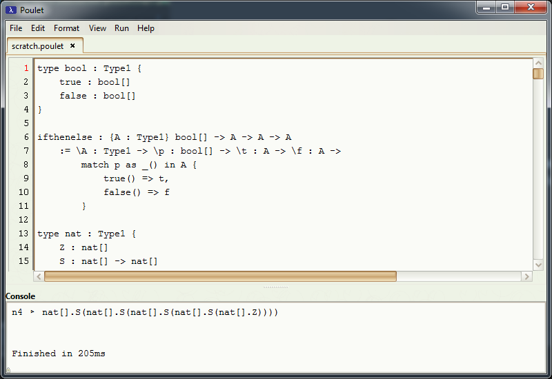

</img>
=
Poulet is a dependently typed language used to program and check computer readable proofs. It comes with an interpreter integrated into a simple IDE.

# Installation
To use Poulet simply run the `.jar` file in the `releases` folder.

# Screenshots

